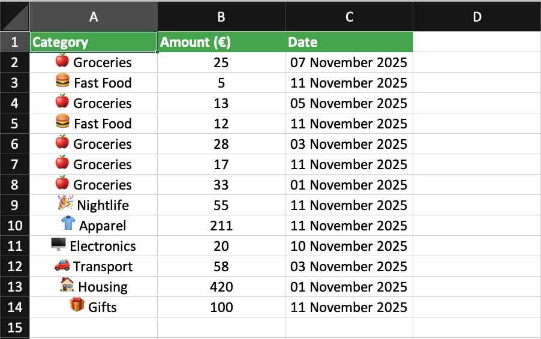

# Money-Bot 💰


[](https://codecov.io/gh/cenoff/Money-Bot)


A simple Telegram bot for tracking personal expenses. Built with Python.

## Why I Built This

I got tired of expense tracking apps that bombard you with ads, don't sync properly across devices, or only work on mobile. Money-Bot runs entirely in Telegram, so you can use it on your phone, laptop, or any device where you have Telegram installed. No ads, no subscription fees, just straightforward expense tracking.

## What It Does

**Track expenses across 13 categories** - everything from groceries to entertainment. Add an expense in seconds and it's logged immediately.

**Manage subscriptions** - I built this feature because I kept forgetting about recurring charges. Add your Netflix, Spotify, or whatever subscriptions you have, and the bot automatically logs them on the 1st of each month. You can see monthly and yearly costs at a glance.

**Visual stats** - Get a color-coded chart showing where your money goes. The bot generates these on-demand, no waiting around.

**Export your data** - Download XLSX reports for the current month or your entire history. Useful when you need to review spending patterns or share data with your accountant.

**Savings tracker** - This is a personal feature I added. I use it to track money I *didn't* spend on things (like when I skip buying something unnecessary). It's a psychological trick that works surprisingly well.

## Tech Stack

Here's what's under the hood:

- **Python** with **aiogram** for the bot framework
- **aiosqlite** for async database operations
- **pandas** + **XlsxWriter** for generating Excel reports
- **matplotlib** for charts (runs in ThreadPoolExecutor since it doesn't support async)
- **APScheduler** for automatic subscription renewals

The database uses both aiosqlite (for real-time stuff) and sqlite3 (because pandas doesn't play nice with async databases).

## Installation & Setup

### Prerequisites

- Python 3.9 or higher
- A Telegram bot token (get one from [@BotFather](https://t.me/BotFather))

### Steps

1. **Clone the repository**
   ```bash
   git clone https://github.com/cenoff/Money-Bot.git
   cd Money-Bot
   ```

2. **Create a virtual environment**
   ```bash
   python -m venv venv
   source venv/bin/activate  # On Windows: venv\Scripts\activate
   ```

3. **Install dependencies**
   ```bash
   pip install -r requirements.txt
   ```

4. **Set up environment variables**
   
   Create a `.env` file in the root directory:
   ```env
   BOT_TOKEN=your_telegram_bot_token_here
   DB_PATH=money_tracker.db
   ```

5. **Run the bot**
   ```bash
   python main.py
   ```

### Running with Docker

1. **Create a `.env` file** in the project root with your bot token:
   ```env
   BOT_TOKEN=your_telegram_bot_token_here
   DB_PATH=money_tracker.db
   ```
   
2. **Build and run**:
   ```bash
   docker-compose up -d
   ```
   
3. **View logs**:
   ```bash
   docker-compose logs -f bot
   ```
   
4. **Stop**:
   ```bash
   docker-compose down
   ```


### Running Tests

```bash
pip install -r requirements-dev.txt
pytest
```

## How It's Organized

```
main.py          # Bot initialization and scheduler setup
logic.py         # Message handlers and main logic
keyboard.py      # UI keyboards
graphs.py        # Chart generation
sql.py           # Database and report generation
constants.py     # Configuration
```

Nothing fancy, just organized in a way that makes sense when you're working alone on a project.

## Testing

The project includes **93% test coverage** across all major components:

- **Unit tests** for database operations (`test_sql.py`)
- **Integration tests** for bot handlers (`test_handlers.py`)
- **Graph generation tests** (`test_graphs.py`)
- **Keyboard tests** (`test_keyboard.py`)
- **Main bot initialization tests** (`test_main.py`)

## Demo

Check out a quick demo here: 


XLSX Report Example:



## What's Next

Some features I'm planning to add when I have time:

- Export options for 3, 6, and 12-month periods
- PDF reports (XLSX works but PDF is cleaner for sharing)
- End-of-month summaries comparing spending to previous months
- More expense categories
- A proper savings goal tracker (different from the current "saved money" feature)


## License

This project is licensed under the [MIT License](LICENSE).